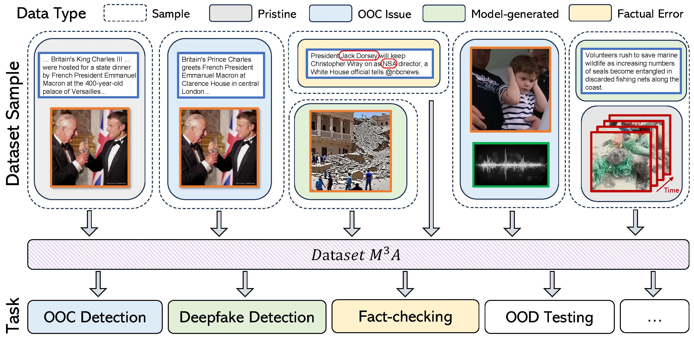

# $M^3A$: A Multimodal Misinformation Dataset for Media Authenticity Analysis

[](https://doi.org/10.1016/j.cviu.2024.104205)

Qingzheng Xu¹, Huiqiang Chen², Heming Du¹, Hu Zhang¹, Szymon Łukasik³, Tianqing Zhu², Xin Yu¹*

¹ The University of Queensland, 280-284 Sir Fred Schonell Dr, St Lucia QLD 4067, Australia  
² The University of Technology Sydney, 15 Broadway, Ultimo NSW 2007, Australia  
³ AGH University of Science and Technology, al. Adama Mickiewicza 30, 30-059 Kraków, Poland



*Demonstration of $M^3A$ Application.* $M^3A$ contains data generated in various methods, facilitating multiple misinformation detection tasks such as OOC detection, deepfake detection, fact-checking, OOD testing and so on.

## Data Repository
To access the dataset, please complete the [Data Access Protocol Form](https://forms.gle/ttrghpwpVpnuvTgf6). A download link will be provided upon approval.

## Abstract
With the development of various generative models, misinformation in news media becomes more deceptive and easier to create, posing a significant problem. However, existing datasets for misinformation study often have limited modalities, constrained sources, and a narrow range of topics. These limitations make it difficult to train models that can effectively combat real-world misinformation. To address this, we propose a comprehensive, large-scale Multimodal Misinformation dataset for Media Authenticity Analysis ($M^3A$), featuring broad sources and fine-grained annotations for topics and sentiments. To curate $M^3A$, we collect genuine news content from 60 renowned news outlets worldwide and generate fake samples using multiple techniques. These include altering named entities in texts, swapping modalities between samples, creating new modalities, and misrepresenting movie content as news. $M^3A$ contains 708K genuine news samples and over 6M fake news samples, spanning text, images, audio, and video. $M^3A$ provides detailed multi-class labels, crucial for various misinformation detection tasks, including out-of-context detection and deepfake detection. For each task, we offer extensive benchmarks using state-of-the-art models, aiming to enhance the development of robust misinformation detection systems.

## Main Contributions
- We present $M^3A$, the first comprehensive large-scale multimodal misinformation dataset with news samples in text, image, audio, and video formats from reputable news outlets, addressing limitations in misinformation generation, data modality, scale, and topic diversity.

- $M^3A$ includes multi-class annotations essential for various misinformation detection tasks, such as out-of-context detection, deepfake identification, and fact-checking.

- We propose benchmarks for $M^3A$ tailored to various misinformation detection tasks, utilizing state-of-the-art models and out-of-distribution testing to support further research in misinformation detection.

## Dataset Comparison
| Dataset               | Source (# News Outlets) | Size   | Text | Image | Audio | Video | OOC | DF det. | Fact check | OOD |
|-----------------------|-------------------------|--------|------|-------|-------|-------|------|---------|------------|-----|
| **MAIM**             | Flickr                 | 239k   | ✅   | ✅    | ❌    | ❌    | ✅   | ❌      | ✅         | ❌  |
| **MEIR**             | Flickr                 | 57k    | ✅   | ✅    | ❌    | ❌    | ✅   | ❌      | ✅         | ❌  |
| **NeuralNews**       | GoodNews (1)           | 128k   | ✅   | ✅    | ❌    | ❌    | ✅   | ❌      | ✅         | ❌  |
| **TamperedNews**     | BreakingNews (4)       | 776k   | ✅   | ✅    | ❌    | ❌    | ✅   | ❌      | ✅         | ❌  |
| **COSMOS**           | 18 News Outlets        | 453k   | ✅   | ✅    | ❌    | ❌    | ✅   | ❌      | ❌         | ❌  |
| **NewsCLIPpings**    | VisualNews (4)         | 988k   | ✅   | ✅    | ❌    | ❌    | ✅   | ❌      | ✅         | ✅  |
| **DGM⁴**             | VisualNews (4)         | 239k   | ✅   | ✅    | ❌    | ❌    | ✅   | ✅      | ✅         | ❌  |
| **M³A (Ours)**       | 60 News Outlets        | 7m     | ✅   | ✅    | ✅    | ✅    | ✅   | ✅      | ✅         | ✅  |

**Notes**:
- **OOC** refers to out-of-context issue detection.
- **DF det.** refers to deepfake detection.
- **OOD** refers to out-of-distribution testing.

## Illustration of misinformation generation methods in $M^3A$


(a) Named Entity Manipulation (NEM), (b) Multimodality Mismatching (MM), (c) Text-driven Multimodality Generation (TMG), (d) Multimodality-driven Text Generation (MTG), and (e) Movie to News (M2N), together with four types of data (Pristine, Factual Error, OOC Issue, and Modal-generated).

## Citation
If you found $M^3A$ useful in your research or applications, please kindly cite using the following BibTeX:
```
@article{xu2024m3a,
title = {M3A: A multimodal misinformation dataset for media authenticity analysis},
journal = {Computer Vision and Image Understanding},
volume = {249},
pages = {104205},
year = {2024},
issn = {1077-3142},
doi = {https://doi.org/10.1016/j.cviu.2024.104205},
url = {https://www.sciencedirect.com/science/article/pii/S1077314224002868},
author = {Qingzheng Xu and Huiqiang Chen and Heming Du and Hu Zhang and Szymon Łukasik and Tianqing Zhu and Xin Yu},
}
```
---
